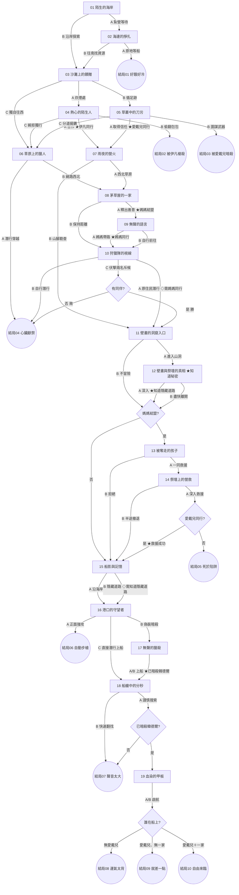

# 冒險001 劇情樹狀圖（定案）

小說：失去記憶的我，如何在這座奇異的島上生存?
結構：DAG＋狀態旗標。允許路徑合流；結局由旗標組合判定。
規模：19 個篇章節點（前段 01~06、中段 07~13、後段 14~19）＋ 10 個結局節點。

## 狀態旗標清單

| 旗標 | 設定來源 | 影響 |
|---|---|---|
| 伊凡同行 | 篇章04選A；篇章15自動設定(設定規則：抵達北港前必加入) | 文本描寫用(結局08/09/10中伊凡的行動由此保證) |
| 愛戴兒同行 | 篇章05選A | 篇章10-C結果、篇章14結果(識破陷阱)、篇章19結局判定(08/09/10) |
| 見過愛戴兒 | 篇章05(進入即設定) | 結局08的條件段落(主角想起她說過只有她會開船的懊悔) |
| 媽媽結盟 | 篇章08選A | 篇章11/12後是否進入篇章13、篇章19結局判定(10) |
| 媽媽同行 | 篇章09選A | 篇章10出現「原住民潛行」安全選項；計入同伴判定 |
| 知道秘密 | 篇章12(見壁畫)；篇章14(進洞時亦設定)；篇章15恢復記憶時自動補齊皇室陰謀層 | 文本(劇情解鎖) |
| 知道隱藏道路 | 篇章12選A | 篇章15出現隱藏道路路線選項(文本風味) |
| 救援成功 | 篇章14選A且愛戴兒同行 | 篇章19結局判定(10)；一家是否上船 |
| 已暗殺韓德爾 | 篇章17 | 篇章18結果(結局07 vs 前進) |

註：結局01/02/03 的「尚未見過友善一家或部落」由圖結構保證（三結局皆位於篇章08之前），不需旗標。

## 篇章節點與選擇題

### 前段（求生、探索、信任考驗）

- **篇章01 陌生的海岸**（初始）：主角在東北側礁岩海岸醒來，失憶，口袋有打火機。
  - 選擇「如何撐過第一晚？」A 就地紮營生火等待救援 → 02｜B 趁天黑前沿海岸探索 → 03
- **篇章02 海邊的掙扎**：紮營求生不順，夜寒、抓蟹失敗、豪雨。
  - A 繼續守在原地等船經過 → **結局01**｜B 拖著身體沿沙灘往南尋找資源 → 03
- **篇章03 沙灘上的饋贈**：拾獲小刀與小型醫護箱；望見東側平原炊煙與往南的人為足跡。
  - A 前往炊煙處 → 04｜B 循足跡往南 → 05｜C 都太可疑，獨自往西內陸 → 06
- **篇章04 熱心的陌生人**：遇見伊凡，表面熱心；信任考驗（他提議搭夥並要求保管打火機）。
  - A 同意合作共享資源【設：伊凡同行】→ 07｜B 認定他圖謀不軌，趁夜偷翻他的包包 → **結局02**｜C 婉拒同行，獨自往西 → 06
- **篇章05 草叢中的刀刃**：被愛戴兒伏擊試探；信任考驗（要求主角證明自己有用）。
  - A 展現生存能力與誠意【設：愛戴兒同行】→ 07｜B 假意合作，盤算奪走她的武器 → **結局03**｜C 互換情報後分道揚鑣，獨自往西 → 06
- **篇章06 草原上的獵人**：獨自西行，遠處出現原住民狩獵隊。
  - A 壓低身子潛行穿越其範圍 → **結局04**｜B 繞遠路避開，往西北草原 → 08

### 中段（友善一家互動、原住民躲避/交戰、山洞）

- **篇章07 雨夜的營火**：與同伴（伊凡或愛戴兒）夜談身世，豪雨；決定往西尋找食物與失憶線索。
  - A 天亮後往西北草原探水源與食物 → 08｜B 先往山腳勘查失憶線索 → 11
- **篇章08 茅草屋的一家**：於西北草原遇友善一家（媽媽與兩名小孩），受排擠而隱居。
  - A 拿出食物釋出善意【設：媽媽結盟】→ 09｜B 保持距離，遠遠觀察後離開 → 10
- **篇章09 無聲的語言**：比手畫腳交流；媽媽教辨識可食植物並比劃出危險範圍；感受到她想離島的渴望。
  - A 請媽媽帶路前往山腳【設：媽媽同行】→ 10｜B 不再打擾，依她的指引自行前往 → 10
- **篇章10 狩獵隊的視線**：往山腳途中，狩獵隊擋在必經之路。
  - A（需媽媽同行）跟隨媽媽的原住民潛行方式繞過 → 11
  - B 自行潛行 → **結局04**
  - C 伏擊落單的兩名斥候 → 條件結果：有同伴（伊凡同行/愛戴兒同行/媽媽同行任一）→ 勝 → 11；主角單獨 → 敗被俘 → **結局04**（依交戰規則：主角與配角遇二人以下才勝）
- **篇章11 壁畫的洞窟入口**：較矮山上的山洞入口，有褪色記號。
  - A 進入山洞探索 → 12｜B 不冒險，紮營遠觀聖山 → 條件轉場：媽媽結盟 → 13；否則 → 15
- **篇章12 壁畫與祭壇的真相**：壁畫揭露心臟祭祀與囚犯來源【設：知道秘密】；驚險避開一處陷阱，遠望祭壇。
  - A 沿通道深入，發現隱藏道路的線索【設：知道隱藏道路】→ 條件轉場（同11-B）｜B 盡快離開山洞 → 條件轉場（同11-B）
- **篇章13 被奪走的孩子**（僅媽媽結盟路徑）：兩名小孩被抓往祭壇，媽媽哀求協助。
  - A 與媽媽一同潛入山洞救援 → 14｜B 硬起心腸拒絕，先為逃島做準備 → 15

### 後段（逃離、秘密全貌）

- **篇章14 祭壇上的營救**：與媽媽潛入山洞救小孩；若先前未進過山洞，於此見到壁畫【設：知道秘密】。
  - A 繼續深入直達祭壇 → 條件結果：愛戴兒同行（識破陷阱記號）→ 救援成功【設：救援成功】→ 15；否則 → **結局05**
  - B 半途察覺不對勁而撤退 → 15（未救援，一家不上船）
- **篇章15 船影與記憶**：望見探測船，恢復完整記憶（含皇室陰謀，【補設：知道秘密】）；伊凡若未同行則在此現身加入【設：伊凡同行】；決定奪船逃島。
  - A 沿海岸線前往北港 → 16｜B（需知道隱藏道路）走隱藏道路快速抵達 → 16
- **篇章16 港口的守望者**：偵查韓德爾（顧船、吃泡麵、識別遠方能力差）。
  - A 全員正面強攻 → **結局06**｜B 利用偽裝接近並暗殺 → 17｜C 不動韓德爾，趁其背對時潛行上船 → 18
- **篇章17 無聲的獵殺**：偽裝奏效，暗殺韓德爾【設：已暗殺韓德爾】。
  - A 藏好屍體再上船 → 18｜B 搶時間直接上船 → 18
- **篇章18 船艙中的分秒**：潛入船艙，兵分多路；主角單獨行動。
  - A 緩慢謹慎逐艙搜索 → 條件結果：已暗殺韓德爾 → 19；否則 → **結局07**
  - B 加快速度翻找武器與鑰匙（發出聲響）→ **結局07**
- **篇章19 血染的甲板**：制伏船上其他人；船長在觸碰無線電前被伊凡殺死。
  - A 立刻發動引擎啟航｜B 先收攏船上武器再啟航 —— 兩選項皆進入條件判定：
    - 無愛戴兒同行 → **結局08**
    - 愛戴兒同行、但未(救援成功) → **結局09**
    - 愛戴兒同行＋救援成功 → **結局10**

## 結局判定表

| 結局 | 進入點 | 條件 |
|---|---|---|
| 01 好餓...好冷... | 02-A | 結構保證(未見一家) |
| 02 你居然開我一槍?! | 04-B | 獨自見伊凡＋不利選項(單一關鍵選擇) |
| 03 我居然被暗殺了?! | 05-B | 獨自見愛戴兒＋背叛選項(單一關鍵選擇) |
| 04 心臟被挖出來... | 06-A、10-B、10-C(單獨) | 未用媽媽潛行方式潛行被俘 / 交戰戰敗 |
| 05 這裡居然有陷阱!! | 14-A | 救援時愛戴兒未同行 |
| 06 自動步槍太誇張... | 16-A | 正面與韓德爾交戰 |
| 07 聲音太大了啦!! | 18-A(未暗殺)、18-B | 未先暗殺韓德爾 或 發出聲響 |
| 08 運氣也太背了... | 19 | 已暗殺＋無聲響＋愛戴兒未上船 |
| 09 就差一點點了阿!! | 19 | 已暗殺＋無聲響＋愛戴兒上船、一家未上船 |
| 10 自由終於來臨了~~ | 19 | 已暗殺＋無聲響＋愛戴兒與一家皆上船 |

## Mermaid 劇情圖

註記：★＝設定旗標；◇＝選項需旗標才顯示；J＝依旗標決定去向的條件判定（玩家無選擇）。

## 引擎需求備註（供網站開發階段）

1. 選項可依旗標條件顯示（10-A、15-B）。
2. 篇章可有「條件轉場/條件結果」：依旗標決定下一節點（10-C、11-B/12 之後、14-A、18-A、19）。
3. 旗標為布林值，單向設定（設定後不清除）。
4. 篇章文本可含「條件段落」：以【條件段落｜<條件>】...【/條件段落】標記，僅在旗標條件成立時顯示（目前篇章14「愛戴兒同行時」、篇章15「伊凡未同行時」與結局08「見過愛戴兒時」使用）。結局文本同樣支援此標記。

## 設計備註

1. 篇章10-C 採條件結果：有同伴勝、單獨敗，完全符合角色設定的交戰規則。
2. 篇章12-A 會設定「知道隱藏道路」並解鎖 15-B 選項；篇章17、19 的選項為風味選項（不改變路線，僅影響文本描寫）。
3. 篇章07-B 提供跳過友善一家的路線（中段較短），對應「友善一家互動＝劇情解鎖、非必經」的設定。
4. 篇章14-B「半途撤退」為刻意保留的逃生口：未帶愛戴兒的玩家可撤退避開結局05，代價是一家不上船、結局10不可達。
